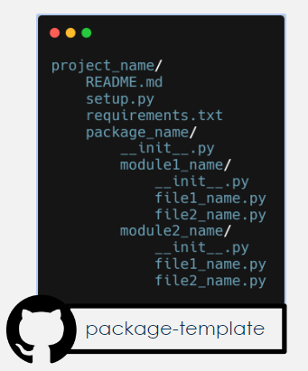

# DIO - NTT DATA - Engenharia de Dados com Python

## Lab Project - Criando um Pacote de Processamento de Imagens com Python

O desafio demonstar a arquitetura e passos para criar um pacote em Python

## Arquitetura

A arquitetura básica do pacotes fica como a abaixo:
packaging_tutorial/
├── LICENSE
├── pyproject.toml
├── README.md
├── src/
│   └── example_package_YOUR_USERNAME_HERE/
│       ├── __init__.py
│       └── example.py
└── tests/

Ou como no repositório <https://github.com/tiemi>:



A primeira opção usa o pyproject.toml para configurar o pacote, e na segunda está usando o setup.py. A segunda opção parece ser a mais atual, e segue a própria documentação do Python <https://packaging.python.org/en/latest/tutorials/packaging-projects/>

## Compilar pacote

Para gerar os pacotes de distribuição executa-se o comando:

```sh
pip install -q build
python -m build
```
